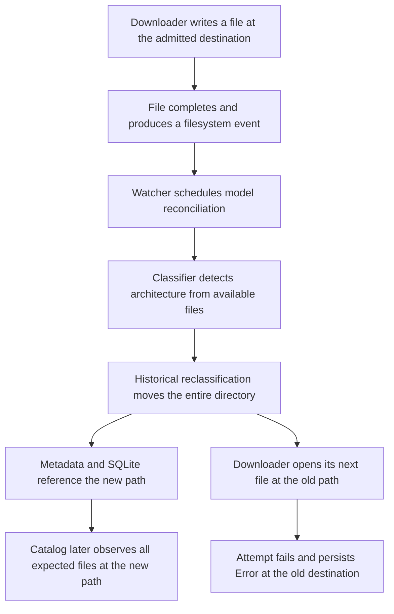

# Download destination and model catalog investigation

Date: 2026-10-10. Scope: the three retained Error downloads implicated in the
installed application's startup failure. Current source reviewed:
`1a78ea8ecbe3ddf589d84db6783577eaf4efb79d`, based on GitHub main
`ad31e391dcd94c204b3fcd748cc98d27b3281e65`. The original checkout's existing
source and documentation changes were preserved.

## Finding

The model files exist. Their downloads were interrupted when Pumas moved their
directories during reclassification. The download attempts retained the old
destinations, while the model catalog subsequently described the new paths.
This discrepancy predates the October metadata upgrade.

Historical logs directly establish the move followed by the next-file failure
for all three models. The precise trigger was not logged, but the historical
watcher/reconciliation flow supplies a matching production path: completion of
a file makes the model scope dirty; reconciliation detects its architecture
and reclassifies the directory while the download is still active.

The previous explanation that these folders might never have been created was
too definite. They existed and contained downloaded files before Pumas moved
them. These are absent old destinations, not empty models awaiting a first
download.

## Filesystem and metadata evidence

Paths below are relative to `shared-resources/models`. Each artifact's basename
stayed the same; only its category/family parent changed.

| Model | Destination in downloads.json | Actual SQLite catalog parent | Expected files present | Combined file sizes |
| --- | --- | --- | --- | --- |
| Huihui Qwen3.8 27B GGUF | `vlm/huihui-qwen3_8/` | `vlm/qwen35/` | 2 / 2 | 17,482,462,272 bytes |
| DavidAU Qwen3.8 27B Turbo GGUF | `vlm/qwen3_8/` | `vlm/qwen35/` | 3 / 3 | 19,433,235,707 bytes |
| inclusionAI LLaDA Image Turbo FP8 | `diffusion/inclusionai/` | `diffusion/vit/` | 33 / 33 | 27,610,502,872 bytes |

All 38 expected files are regular files at the catalog destinations. Their
combined sizes match each catalog row's `downloaded_size_bytes`. The catalog
paths and each directory's `metadata.json` agree about model identity and
family. All three old destinations are absent. File existence, type, size,
inode and timestamps were inspected; model payloads were not opened or hashed.
This establishes presence and matching aggregate sizes, not cryptographic
integrity or inference compatibility.

The read-only query used the actual `shared-resources/models/models.db`.
`library.db` has no tables; `link_registry.db` contains link/settings tables.
All three model rows contain repository, download URL, selected artifact files
and expected files. `intent_declarations` has no rows. `downloads.json` retains
the original requests, execution file lists and queue admissions, with status
`error`. SQLite reports progress `1.0`, no missing expected files and
`download_incomplete: false` at the new destinations.

The live LLaDA metadata still has `match_source: download_partial`, despite all
33 expected files now being present. The inspected legacy metadata does not
carry modern import publication/completion receipts. It therefore cannot be
treated as proof that the old failed attempts completed under today's custody
contract.

## Historical sequence

The following times are UTC, taken directly from the retained desktop log:

| Model | File completed immediately before move | Reclassification | Next-file failure |
| --- | --- | --- | --- |
| Huihui | 2026-09-06 00:11:36.612588, file 1 / 2 | 00:11:36.728180 | 00:11:37.355366 |
| DavidAU | 2026-09-10 22:37:12.446245, file 2 / 3 | 22:37:12.562144 | 22:37:13.203133 |
| LLaDA | 2026-09-13 00:38:23.778677, file 17 / 33 | 00:38:23.901909 | 00:38:24.529533 |

Every failure names `open partial download file` and `No such file or directory`.
Each occurs approximately 0.63 seconds after its directory move. The new
classified parents exactly match the present catalog paths.

Later logs include attempts to continue downloads after the initial failures.
The complete files and their timestamps establish that output exists at the
new paths now. They do not uniquely identify which later retry, recovery or
external action produced every remaining file. No claim is made about that
unlogged part of the history.

The October startup restored these old Error attempts using their persisted
destinations and encountered the absent directory. The recent startup fix
prevents that secondary failure; it does not reconcile the original attempts
with the moved artifacts.

## Architecture and flow



Three responsibilities must be distinguished:

- Acquisition/download owns the selected file set, admitted workspace, worker
  lifecycle, queue custody and attempt settlement in the versioned JSON store.
- Model publication/classification owns model identity, metadata and authorized
  directory relocation.
- Catalog projection owns a searchable view of the current model location and
  filesystem availability; it does not settle download attempts.

The historical defect was competing mutation authority over the same directory.
The downloader's destination lock did not coordinate with reconciliation's
rename. Classification also participates in the physical path and model ID,
so a classification change invalidated the active worker's location. This is
concrete lifecycle/location coupling, rather than complexity inferred from
module sizes.

Historical source `1f49100437f18034b26a09253bdd57d4c4708679`, a nearby retained
September 5 revision, contains this matching path:

- `api/reconciliation.rs:1369` indexes a changed directory with metadata and
  calls `reclassify_model` without consulting durable download custody.
- `model_library/library.rs:3155` classifies from local files, performs a
  no-replace directory rename, writes destination metadata, removes the old
  catalog row and indexes the new location. It does not coordinate the active
  download destination or update its attempt records.

That revision is source evidence for the historical mechanism, not a proven
build identifier for every September process. The runtime logs independently
prove the moves and ensuing failures.

Current source is substantially stronger:

- `api/builder.rs:631` configures a shared acquisition service and lifecycle-owned
  importer before restoring downloads.
- `model_library/hf/download.rs:4844` publishes partial download metadata through
  an exact transfer capability. Final import is separately capability/receipt
  bound; partial discovery is not completion authority.
- `model_library/library.rs:4611` routes relocation through an owned operation,
  holding physical exclusion and obtaining mutation authority before rename.
- `model_library/mutation_authority.rs:470` acquires the root grant and validates
  target identities; `:577` rejects active queue admissions, hidden admissions,
  nonterminal acquisitions or unresolved quarantines before mutation.
- `api/reconciliation.rs:613` treats a busy root as deferred background work.
- `model_library/library/projection.rs:43` builds catalog availability from the
  current directory. `library.rs:7747` checks expected file presence, partial
  files and sizes; its progress value is not a download completion receipt.
- `model_library/hf/download.rs:5758` finds tracked attempts by destination
  identity. An artifact at a different family path does not automatically
  become the same admitted workspace.

## Coding standards MCP review

The MCP selected applicable policy from snapshot
`snapshot:v1:32f18bf7-e195-4ca5-b0c2-ed993eb0b18a`. This was an evidence-backed
manual review against its authoritative policy, not an automated certification
of the repository. The findings apply to the traced paths only.

| Finding | MCP requirement | Assessment |
| --- | --- | --- |
| Active directory moved by a separate owner | `topic.architecture` Data And State Authority; `topic.code-design` Simplicity And Ownership | Confirmed historical violation: download and reconciliation could mutate one directory without a shared lifecycle contract. Current relocation uses shared mutation/custody authority. |
| Download destination and relocated model location diverged | `topic.concurrency` Preserve Related Invariants; `profile.boundary.persistence` Durable Mutation Contract | Confirmed historical violation: directory/index changes did not preserve the active attempt's location invariant. Current code prevents relocation under custody rather than guessing a replacement destination. |
| Retained legacy attempts remain disconnected from moved complete artifacts | `topic.resilience` Replay And Resumption Evidence; `workflow.verification` | Current recovery gap: the crash guard preserves records but does not prove convergence or settlement. A successful startup is not evidence that historical attempts have been reconciled. |
| Similar completion language represents different facts | `topic.code-design` Code And Terminology Discipline; `topic.architecture` Data And State Authority | Architectural risk: catalog file availability and attempt completion must remain distinct in APIs/UI. Both observed values can be true: the old attempt failed, and files now exist at a different location. No SQLite-versus-JSON winner should be invented. |
| Rename, metadata and catalog publication span durable boundaries | `profile.boundary.persistence` Durable Mutation Contract | Failure-path review item, not the demonstrated cause. Current code retains claims on unconfirmed mutation and uses conditional publication for receipt-backed imports. This investigation did not inject every interruption in the legacy relocation branch. |

The shared mutation authority was introduced in retained history at
`22388e702` on September 14, after these three observed failures. Later work
extended the exact acquisition/import proofs. The historical flaw should not
be presented as an unguarded current-main rename.

## Verification and limits

The read-only diagnostic command is:

```bash
python3 /tmp/pumas-path-investigation-20261010/check-path-discrepancy.py
```

It has been run and exits 1 with the exact mismatch: three Error attempts with
absent old destinations and complete catalog records. It also checks all
expected file paths at both locations and confirms downloads.json bytes did
not change during inspection. Full metadata/stat evidence is retained at
`/tmp/pumas-path-investigation-20261010/path-evidence.json`; relevant historical
log excerpts are in `historical-moves.log` in that directory.

Existing isolated tests were run on the reviewed current source:

- `canonical_acquisition_custody_blocks_model_mutation_until_withdrawal`: passed.
- `busy_download_root_defers_background_reconciliation_without_failing_shutdown`
  and `busy_download_root_remains_a_forced_refresh_error_without_failing_shutdown`:
  both passed.
- `restore_missing_destination_retains_download_without_failing_startup`: passed.

These prove focused current guards and preservation behavior. They do not prove
a full download/watcher/reclassification/restart handoff or safe adoption of
these legacy artifacts. A zero-test exact short-name invocation was discarded
and rerun with the matching filter; only actual executed tests count above.

No application backend was launched against the real library. SQLite queries
used read-only mode. Only metadata files and filesystem stat were inspected.
No model payload was read, copied, hashed, moved, rewritten or deleted; no live
download/custody record was repaired. The discrepancy remains intentionally
available as diagnosis evidence.

## Changes justified by this evidence

1. Preserve the current rule that classification cannot relocate a destination
   while any active or retained download custody owns it. Classification may
   update observations; movement requires the publication owner's permission.
2. Add a composed regression with multiple files: finish one file, deliver the
   real watcher event that changes family, attempt reconciliation, finish the
   remaining download and reopen. Verify no premature relocation and consistent
   attempt settlement and catalog identity.
3. Design explicit reconciliation for legacy moved outputs. Match exact artifact
   selection, original attempt/admission and destination history; establish the
   required output proof and let the owning lifecycle settle the old attempt.
   Repository name, equal byte totals, a catalog row or an absent old folder
   alone must not authorize rewriting custody, declaring completion or
   downloading a second copy.
4. Present artifact availability separately from failed historical attempt
   status, with a useful diagnostic when they refer to different paths.
5. Before extending relocation behavior, verify interruptions across rename,
   metadata, catalog and custody publication through the real adapters. Keep
   recovery at one coherent owner instead of adding independent JSON/SQL repairs.

No production implementation changes are part of this investigation.
